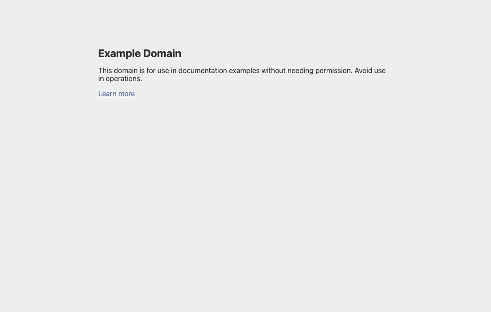
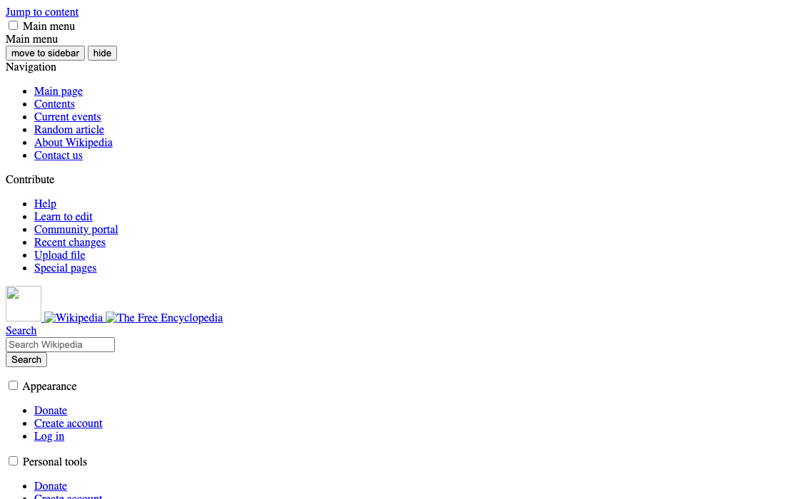

# DummySite

Exercise 5.1 – DevOps with Kubernetes.

A `DummySite` custom resource creates a copy of the web page at `website_url`:

```yaml
apiVersion: stable.dwk/v1
kind: DummySite
metadata:
  name: example
spec:
  website_url: https://example.com/
```

## How it works

- **CRD** (`manifests/crd.yaml`): `dummysites.stable.dwk`, namespaced, with the required string property `spec.website_url` (must start with `http://` or `https://`). `kubectl get dummysites` shows the URL.
- **Controller** (`controller/index.js`, image `parthvasave/dummysite-controller:5.1`): a Node.js app using the official [Kubernetes JavaScript client](https://github.com/kubernetes-client/javascript) `@kubernetes/client-node` 2.0. It watches `/apis/stable.dwk/v1/dummysites` in all namespaces and restarts the watch when it ends. For every `ADDED` or `MODIFIED` DummySite it creates, or updates if they already exist, in the DummySite's namespace:
  - a **Deployment** `dummysite-<name>`. Its init container (`curlimages/curl`) downloads `website_url` into an `emptyDir` volume, and an `nginx` container serves it. The URL is passed as an environment variable and expanded by Kubernetes, not by a shell, so it cannot inject commands.
  - a **Service** `dummysite-<name>` on port 80.
- Both resources have an **owner reference** to the DummySite, so deleting the DummySite deletes them through Kubernetes garbage collection. The controller does not need delete permissions.
- **RBAC** (`manifests/rbac.yaml`): the `dummysite-controller` ServiceAccount, and a ClusterRole and ClusterRoleBinding that allow watching DummySites and creating and updating Deployments and Services.

Only the downloaded HTML is copied, so relative links, CSS and images of more complex pages do not work.

## Usage

```bash
kubectl apply -f manifests/crd.yaml
kubectl apply -f manifests/rbac.yaml          # role, account and binding
kubectl apply -f manifests/deployment.yaml    # the controller
kubectl apply -f manifests/dummysite.yaml     # example.com and the Kubernetes Wikipedia article

kubectl port-forward svc/dummysite-example 8080:80
```

## Test (k3d)

```
$ kubectl get dummysites
NAME                   WEBSITE URL                                AGE
example                https://example.com/                       0s
kubernetes-wikipedia   https://en.wikipedia.org/wiki/Kubernetes   0s

$ kubectl logs deploy/dummysite-controller
Watching DummySite resources
Reconciling DummySite default/example (https://example.com/)
Reconciling DummySite default/kubernetes-wikipedia (https://en.wikipedia.org/wiki/Kubernetes)
Created Deployment default/dummysite-example
Created Deployment default/dummysite-kubernetes-wikipedia
Created Service default/dummysite-kubernetes-wikipedia
Created Service default/dummysite-example
```

The copy of https://example.com/:



The copy of https://en.wikipedia.org/wiki/Kubernetes (about 600 KB of HTML, without its styles):



Deleting `kubectl delete dummysite kubernetes-wikipedia` removed its Deployment and Service within seconds, while `dummysite-example` kept running.

## Run the controller locally

```bash
cd controller
npm install
node index.js   # uses the current kubeconfig context
```
