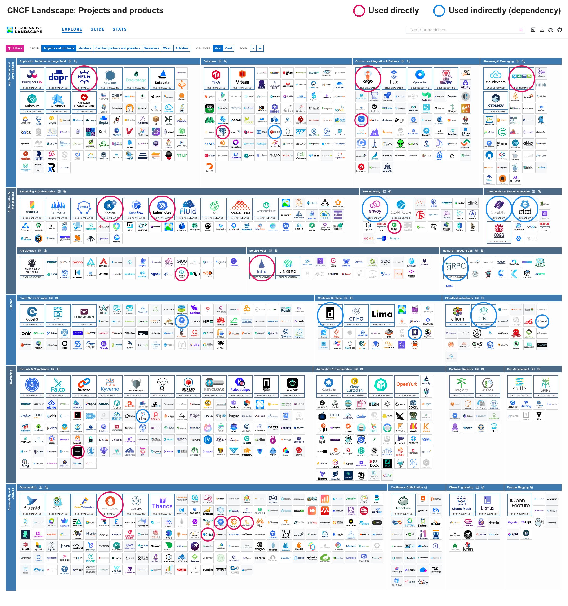
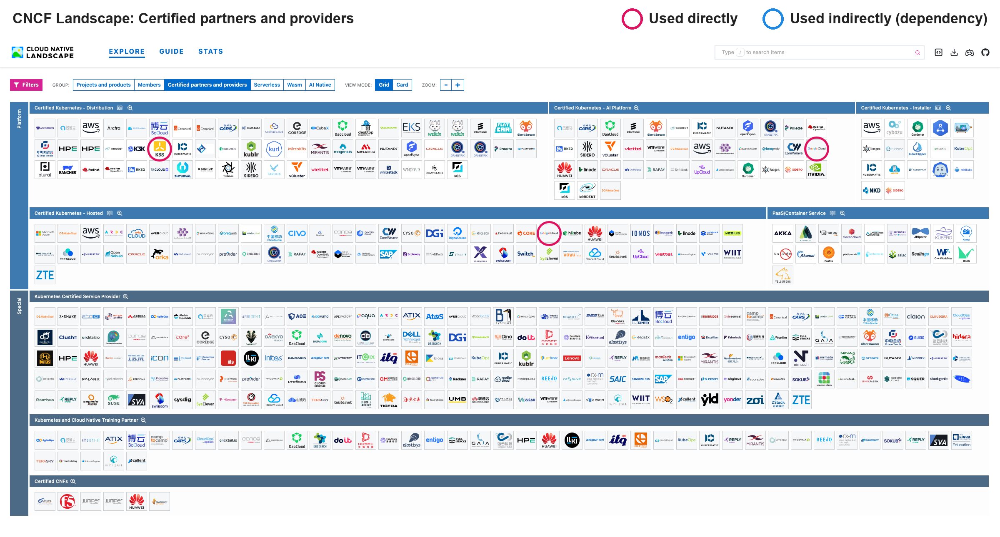
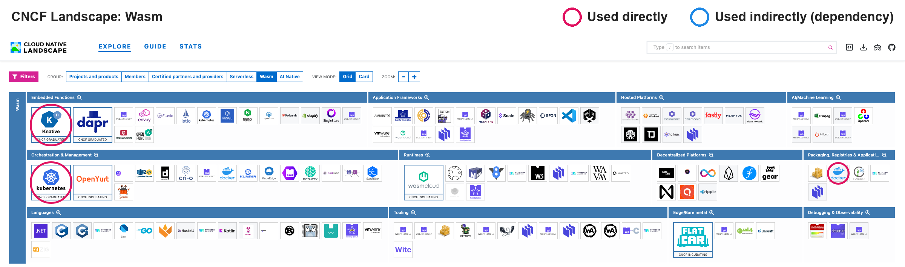

# CNCF Cloud Native Landscape

Exercise 5.8 – DevOps with Kubernetes.

The logos are circled on the [interactive CNCF Landscape](https://landscape.cncf.io/): **pink** for projects and products I used directly, **blue** for those that something I used depends on. The circles were placed from the positions of the logos in the rendered page, so they match the landscape exactly (some items appear in more than one category and are circled everywhere they appear).

k3s and Google Kubernetes Engine are in the "Certified partners and providers" group:

Docker Hub is in the Wasm group, where Kubernetes and Knative appear again:

## Used directly

- I used **Kubernetes** throughout the course, from Part 1 to Part 5.
- I used **k3s** (through k3d) as the local cluster in Parts 1, 2 and 5.
- I used **Google Kubernetes Engine (GKE)** in Parts 3 and 4 for Log output, Ping-pong and the todo project, including Gateway API load balancers, Workload Identity and persistent disks.
- I used **Helm** to install kube-prometheus-stack and Loki in Part 2 (2.10), and kube-prometheus-stack on GKE in Part 4 (4.3).
- I used **Prometheus** to monitor the cluster in Part 2, to query StatefulSet pods in 4.3, as the metrics source of the Argo Rollouts canary analysis in 4.4, and for Kiali and Istio metrics in 5.2 and 5.3.
- I used **Grafana** to view the logs of the todo backend in Part 2 (2.10).
- I used **Grafana Loki** to collect the todo backend's logs in Part 2 (2.10).
- I used **PostgreSQL** as the database of Ping-pong and the todo project from Part 2 onwards, backed up with `pg_dump` in 3.10.
- I used **NATS** as the message broker between the todo backend and the broadcaster in 4.6.
- I used **Argo**: Argo Rollouts for the canary release with CPU analysis in 4.4, and Argo CD for GitOps in 4.7–4.10.
- I used **GitHub Actions** to build and deploy the project to GKE (3.6–3.8), and for the GitOps release workflows in 4.7–4.10.
- I used **Istio** in ambient mode with the Bookinfo sample in 5.2, and for the greeter traffic split in 5.3.
- I used **Kiali** to visualize the service mesh traffic in 5.2 and 5.3.
- I used **Knative** Serving with Kourier in 5.6, and to run Ping-pong serverless in 5.7.
- I used **SOPS** to encrypt the Kubernetes secrets in the repository (Part 2 onwards), and through KSOPS in Argo CD in 4.8–4.10.
- I used **NGINX** as the web server of the DummySite copies in 5.1 and the Wikipedia app in 5.4.
- I used **Traefik**, k3s's default ingress controller, for the Ingress resources in Parts 1 and 2.
- I used **Docker Hub** as the registry for the `parthvasave/*` images.
- I used **Google Stackdriver** (now Google Cloud Logging and Monitoring) to read the project's logs in 3.12.

## Used indirectly

- I indirectly used **containerd**, as both k3s and GKE nodes run containers with it.
- I indirectly used **runc**, which containerd uses to start the containers.
- I indirectly used **Flannel**, the default network of k3s (k3d). In 5.2 Istio's CNI plugin had to be chained after it.
- I indirectly used the **Container Network Interface (CNI)**: Flannel and the Istio CNI plugin are CNI plugins, and fixing Istio's CNI binary path in 5.2 showed how k3s loads them.
- I indirectly used **CoreDNS**, which resolves service names like `pingpong.exercises.svc.cluster.local` in k3s. GKE's NodeLocal DNSCache is also based on it.
- I indirectly used **etcd**, which stores the cluster state of the GKE control plane.
- I indirectly used **gRPC**, which Kubernetes components use to talk to etcd and containerd, and which istiod uses to send configuration to the proxies.
- I indirectly used **Envoy**, as Istio's ingress gateway and waypoint proxies (5.2, 5.3) and Knative's Kourier gateway (5.6, 5.7) are built on it.
- I indirectly used **Redis**, which Argo CD uses as its cache (4.7–4.10).
- I indirectly used **Dex**, which is installed as part of Argo CD for single sign-on.
- I indirectly used **Google Persistent Disk**, which backs the PersistentVolumeClaims of PostgreSQL and the todo app on GKE.

Some things I used are not on the landscape: k3d, Kustomize, Docker Desktop, Google Artifact Registry and Cloud Storage, and the Gateway API. GKE's logging agent Fluent Bit is not on the landscape either (only Fluentd is). GKE Dataplane V2 (Cilium) was not enabled on my cluster, so Cilium is not circled.

## Outside of the course

Everything listed above was used in this course. Nothing is marked as used only outside of the course.
