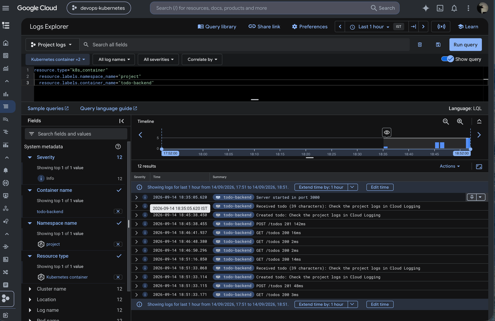
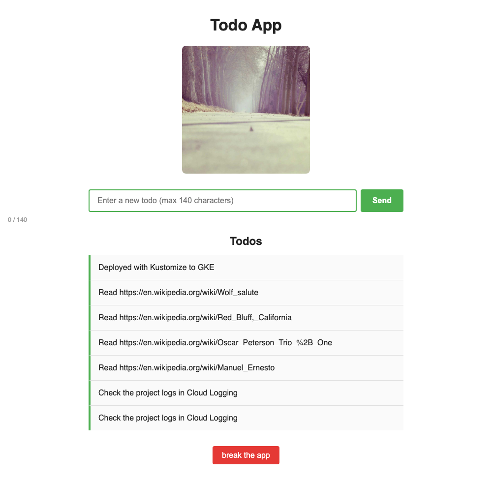
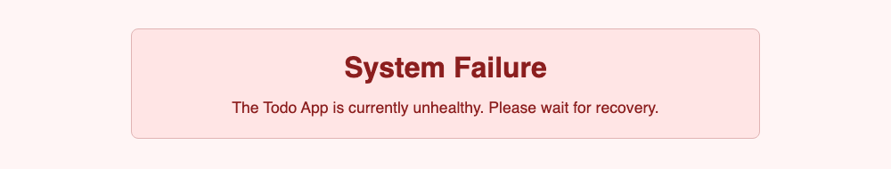
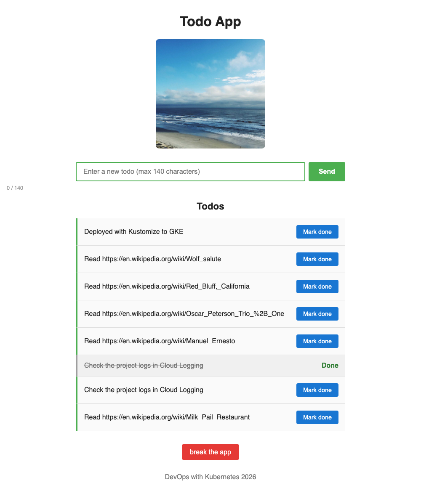

# Todo Project

Documentation for the todo project.

Since Exercise 4.10 the Kubernetes configuration (base, staging and production overlays, service manifests and Argo CD Applications) is in its own repository, [Parth-Vasave/dwk-project-config](https://github.com/Parth-Vasave/dwk-project-config). This repository contains the application code and the workflows that build and release it. See [Separate code and configuration repositories](#separate-code-and-configuration-repositories-exercise-410). Paths such as `project/overlays/...` and `todo-backend/manifests` in the sections below refer to the configuration repository.

## Deploy

Staging and production are deployed by Argo CD. A manual deploy of the base to a namespace of your own still works from a clone of the configuration repository:

```bash
kubectl apply -k project/base   # namespace "project"
sops --decrypt todo-backend/manifests/secret.enc.yaml | kubectl apply -f -
```

The base does not contain the secrets, so the database secret is applied separately. Point SOPS at the age key with `export SOPS_AGE_KEY_FILE=~/.config/sops/age/keys.txt`.

On Google Kubernetes Engine the app is exposed through a Gateway:

```bash
kubectl -n production get gateway todo-gateway
kubectl -n staging get gateway todo-gateway
```

## Database backups (Exercise 3.10)

The `todo-backup` CronJob (`todo-backend/backup`) dumps the database with `pg_dump` every day at 02:00 India time and uploads the dump to the Cloud Storage bucket `devops-kubernetes-508609-todo-backups`. Backups are deleted after 30 days by the bucket's lifecycle rule.

The job gets access to the bucket with Workload Identity, so no key file is needed. The bucket grants `roles/storage.objectCreator` and `roles/storage.objectViewer` to the `todo-backup` Kubernetes service account in the `production` namespace (the `project` namespace before Exercise 4.9):

```bash
gcloud container clusters update dwk-cluster --zone=asia-south1-a --workload-pool=devops-kubernetes-508609.svc.id.goog
gcloud container node-pools update default-pool --cluster=dwk-cluster --zone=asia-south1-a --workload-metadata=GKE_METADATA

gcloud storage buckets create gs://devops-kubernetes-508609-todo-backups --location=asia-south1 --uniform-bucket-level-access --public-access-prevention
MEMBER="principal://iam.googleapis.com/projects/418821991749/locations/global/workloadIdentityPools/devops-kubernetes-508609.svc.id.goog/subject/ns/production/sa/todo-backup"
gcloud storage buckets add-iam-policy-binding gs://devops-kubernetes-508609-todo-backups --role=roles/storage.objectCreator --member="$MEMBER"
gcloud storage buckets add-iam-policy-binding gs://devops-kubernetes-508609-todo-backups --role=roles/storage.objectViewer --member="$MEMBER"
```

Only production is backed up: the CronJob is included in `overlays/production` but not in the base, so staging and branch environments do not have it. Run a backup immediately, list backups, or restore one (into an empty database, since the dump creates the tables):

```bash
kubectl -n production create job manual-backup --from=cronjob/todo-backup
gcloud storage ls gs://devops-kubernetes-508609-todo-backups/
gcloud storage cat gs://devops-kubernetes-508609-todo-backups/<backup file> | kubectl -n production exec -i postgres-ss-0 -- sh -c 'psql -U "$POSTGRES_USER" -d "$POSTGRES_DB"'
```

## DBaaS vs DIY (Exercise 3.9)

The project runs PostgreSQL itself: a StatefulSet with a headless service and a PersistentVolumeClaim in the same namespace as the apps (`todo-backend/manifests/postgres.yaml`). This is compared with a managed database service (DBaaS), such as Google Cloud SQL for PostgreSQL.

Prices are approximate list prices and differ by region; check the Google Cloud pricing pages for exact figures.

### Summary

| | DBaaS (Cloud SQL) | DIY (PostgreSQL in the cluster) |
| --- | --- | --- |
| Initial work | Create an instance, set up networking (private IP or the Cloud SQL Auth Proxy) and IAM | About 50 lines of YAML plus a Secret |
| Time to a working database | Several minutes per instance | Seconds, as part of `kubectl apply` |
| Cost | Separate bill: roughly $8–10/month for the smallest shared-core instance, $50+/month for a dedicated one, double with high availability, plus storage and backups | Uses node capacity that is already paid for, plus the disk (1 GiB ≈ $0.10/month here) |
| Patching and upgrades | Minor versions patched automatically in a maintenance window; major upgrades are a single operation | Done by us: change the image, and dump/restore or `pg_upgrade` for major versions |
| High availability | A checkbox (standby in another zone with automatic failover) | Needs replication set up by hand or an operator such as CloudNativePG |
| Backups | Automated daily backups and point-in-time recovery, restored with one command | Must be built: a `pg_dump` CronJob, volume snapshots or Backup for GKE |
| Monitoring | Built-in metrics, logs and query insights | Must be added (e.g. Prometheus exporter, Loki) |
| Portability | Tied to Google Cloud | The same manifests run on k3d locally and on any Kubernetes cluster |
| Environment per branch | Slow and expensive: one instance (or at least a separate database) per branch | Free and automatic: every branch gets its own PostgreSQL |

### DBaaS

**Pros**

- Very little maintenance: the provider handles the OS, PostgreSQL patches, disk growth (automatic storage increase) and hardware failures.
- Backups work out of the box. Automated daily backups are kept for 7 days by default, and point-in-time recovery restores the database to any moment inside the log retention window. Restoring is one `gcloud sql backups restore` command or a few clicks in the console, either onto the same instance or a new one.
- High availability, read replicas and scaling up the machine are configuration changes rather than projects.
- An SLA (for dedicated instances), encryption at rest, IAM database authentication and audit logging are built in.
- The database lives outside the cluster, so deleting a namespace or even the whole cluster does not touch the data.

**Cons**

- Higher and separate cost. The instance bills around the clock even when idle; high availability doubles it, and storage and backups are billed on top. With free trial credits this is the most significant difference.
- More initial setup: enabling the Cloud SQL Admin API, creating the instance, choosing between private IP (VPC peering) and the Cloud SQL Auth Proxy sidecar, and granting IAM roles to the workload through Workload Identity.
- Creating an instance takes minutes, which does not fit short-lived per-branch environments (Exercises 3.7 and 3.8) well.
- Vendor lock-in and less control: only supported PostgreSQL versions, extensions and settings, and the provider decides when maintenance happens inside the chosen window (a restart of a non-HA instance causes brief downtime).
- The local k3d setup needs a different database, so development and production differ.

### DIY

**Pros**

- Cheap: the database uses capacity on nodes that are already running, and the only extra cost is a small persistent disk per environment.
- Quick and simple to start: `kubectl apply -k project/base` creates the database together with the app, and the same manifests work locally and on GKE.
- Every branch environment gets its own isolated database automatically, and it is removed with the namespace when the branch is deleted.
- Full control over the PostgreSQL version, configuration and extensions, and no vendor lock-in.

**Cons**

- All maintenance is our responsibility: security patches, major version upgrades (a new data directory format, so dump/restore or `pg_upgrade`), disk resizing, tuning and monitoring.
- Availability is limited. There is a single replica on Spot VMs, so a node being reclaimed restarts the database, and apps must handle the reconnect (the ping-pong app needed a restart after its database pod was replaced).
- Data is easy to lose. The `standard-rwo` storage class uses the `Delete` reclaim policy, so deleting the PVC or the namespace deletes the disk and everything on it.
- Backups have to be designed, scheduled, tested and monitored by us.
- Running PostgreSQL on GKE needed extra care, such as setting `PGDATA` to a subdirectory because a new disk contains a `lost+found` folder.

### Backups

**DBaaS:** automated backups and point-in-time recovery are enabled with a flag when the instance is created. On-demand backups are one command (`gcloud sql backups create`), restores are one command, and backup storage is billed per GB. Restoring over an existing instance replaces its data, so restoring to a new instance is safer for testing. Backups normally belong to the instance, and deleting an instance deletes its automated backups unless they are retained explicitly, so a separate export (`gcloud sql export sql` to Cloud Storage) is still useful.

**DIY:** there are several options, and all of them need work:

- A Kubernetes CronJob that runs `pg_dump` and uploads the dump to a Cloud Storage bucket. It is simple and portable, and restoring is `psql < dump.sql`, but it needs a bucket, credentials for the job, retention rules and regular restore tests. It only captures the moment it runs, so there is no point-in-time recovery.
- CSI volume snapshots (`VolumeSnapshot` with the `pd.csi.storage.gke.io` driver) or Compute Engine disk snapshots. They are fast and incremental, but a snapshot of a running database is only crash-consistent, and restoring means creating a new PVC from the snapshot and pointing the StatefulSet at it.
- Backup for GKE, which backs up namespaces including their volumes. It is easier to use but is a paid service billed per protected pod and per GB.
- Continuous WAL archiving (e.g. with WAL-G or an operator like CloudNativePG) for point-in-time recovery. It is closest to what DBaaS offers, but it is the most complex to set up and maintain.

### Conclusion

For this course project, DIY is the better fit. It costs almost nothing on top of the cluster, works the same locally and on GKE, and makes per-branch environments trivial. For a production service with data that matters, DBaaS is usually worth its price, because backups, point-in-time recovery, patching and high availability come ready-made instead of having to be built and maintained by hand.

## Resource requests and limits (Exercise 3.11)

Values are based on `kubectl top pods -n project --containers`, measured at idle and during a load test of 6000 page loads with 40 concurrent requests (about 240 requests per second through the Gateway):

| Container | Idle CPU / memory | Peak under load | Requests | Limits |
| --- | --- | --- | --- | --- |
| todo-app | 2m / 16Mi | 470m / 65Mi | 10m / 32Mi | 500m / 128Mi |
| todo-backend | 1m / 14Mi | 292m / 53Mi | 10m / 32Mi | 300m / 128Mi |
| postgres | 11m / 26Mi | 62m / 42Mi | 25m / 64Mi | 500m / 256Mi |
| random-wiki-todo (CronJob) | short-lived | | 5m / 8Mi | 100m / 32Mi |
| todo-backup `dump` (CronJob) | short-lived | | 10m / 32Mi | 500m / 128Mi |
| todo-backup `upload` (CronJob) | short-lived | | 50m / 128Mi | 500m / 256Mi |

Requests are kept close to idle usage because the e2-medium nodes already have most of their allocatable CPU requested by GKE system pods, and every branch environment needs room for its own copy of the project. Memory limits are about twice the observed peak, so a memory leak is stopped with an OOM kill instead of starving the node. CPU limits sit at the observed peaks, so heavy load is throttled instead of taking CPU from other workloads.

With the limits in place the same load test completed with no restarts or OOM kills (p50 response 0.10 s, p95 0.40 s), and both CronJobs ran successfully.

## Logging (Exercise 3.12)

GKE sends container logs to Cloud Logging, but the cluster was created with only system component logs enabled. Workload logging was turned on so the application logs are collected too:

```bash
gcloud container clusters update dwk-cluster --zone=asia-south1-a --logging=SYSTEM,WORKLOAD
```

The logs are found in the Google Cloud console under **Logging > Logs Explorer**, or from **Kubernetes Engine > Workloads**, choosing a deployment and opening its **Logs** tab. This query shows the todo-backend logs of the main environment:

```
resource.type="k8s_container"
resource.labels.cluster_name="dwk-cluster"
resource.labels.namespace_name="project"
resource.labels.container_name="todo-backend"
```

The same logs can be read from the command line:

```bash
gcloud logging read 'resource.type="k8s_container" AND resource.labels.namespace_name="project" AND resource.labels.container_name="todo-backend"' --freshness=1h --format="table(timestamp,textPayload)"
```

Logs when a new todo is created (the backend logs the received todo, the created todo and the request):



## Health probes (Exercise 4.2)

Both applications have a readinessProbe and a livenessProbe:

| Container | Readiness (`/readyz`) | Liveness (`/healthz`) |
| --- | --- | --- |
| todo-backend | Ready when the database answers `SELECT 1` | Fails only if the server stops answering |
| todo-app | Ready when the app is healthy and the backend's `/readyz` returns 200 | Fails with 500 once the app has been broken |

The chain means todo-app only receives traffic when it is connected to the database through the backend. The database state is checked only by the readiness probes: if PostgreSQL goes down, the pods become not ready but are not restarted, because a restart would not fix the database. Both apps start their HTTP server right away, retry the database in the background, and survive the database restarting.

The **break the app** button sends `POST /break` to todo-app, which sets `isHealthy = false`. From then on every page shows a failure message and `/healthz` returns 500:





The liveness probe checks every 5 seconds and restarts the container after 3 failures. The restarted container starts healthy again. The Gateway's load balancer uses the same `/healthz` path (`todo-app/manifests/healthcheck.yaml`), so it also stops sending traffic to the broken pod.

The apps handle `SIGTERM`. Node runs as PID 1 in the container and ignores the signal by default, so each restart used to wait out the 30-second termination grace period before the container was killed.

Breaking the app on GKE (`kubectl -n project get po` and `GET /` through the Gateway):

```
+1s   todo-app-bd79dfdd7-hnvb8   1/1   Running   restarts=0 | GET / 500   (System Failure page)
+10s  todo-app-bd79dfdd7-hnvb8   1/1   Running   restarts=0 | GET / 503   (load balancer health check failing)
+12s  todo-app-bd79dfdd7-hnvb8   0/1   Running   restarts=0 | GET / 503
+13s  todo-app-bd79dfdd7-hnvb8   0/1   Running   restarts=1 | GET / 503   (liveness probe restarted the container)
+17s  todo-app-bd79dfdd7-hnvb8   1/1   Running   restarts=1 | GET / 503
+23s  todo-app-bd79dfdd7-hnvb8   1/1   Running   restarts=1 | GET / 200   (healthy again)
```

```
Warning  Unhealthy  Liveness probe failed: HTTP probe failed with statuscode: 500
Normal   Killing    Container todo-app failed liveness probe, will be restarted
```

## Done todos (Exercise 4.5)

Todos have a `done` field. The **Mark done** button sends `PUT /todos/<id>` with `{ "done": true }` to todo-app, which forwards it to todo-backend's `PUT /todos/:id` (see `todo-backend/README.md`). On startup the backend adds the `done` column to an existing `todos` table, so the production database kept all of its todos.



```
$ kubectl -n project logs deploy/todo-backend | grep -E "Marked|PUT"
Marked todo 6 as done: Check the project logs in Cloud Logging
PUT /todos/6 200 21ms
```

Todo content is HTML-escaped when the page is rendered, so a todo containing markup is shown as text.

## Broadcaster (Exercise 4.6)

Todo changes are sent to Discord. todo-backend publishes a message to NATS whenever a todo is created or updated, and the `broadcaster` service (6 replicas in one NATS queue group, so each message is sent once) forwards it to a Discord webhook. See `broadcaster/README.md` for the design and tests.

NATS and the broadcaster are part of this kustomization. The Discord webhook secret (`broadcaster/manifests/secret.enc.yaml`) is only added to the main environment, so branch environments log the messages instead of posting them.

## GitOps (Exercise 4.8)

> Since Exercise 4.9 the single `project/gitops` overlay described here is split into staging and production; see [Staging and production](#staging-and-production-exercise-49). The KSOPS setup is unchanged.

The main branch is deployed with GitOps: Argo CD keeps the `project` namespace in sync with the repository, and committing is all it takes to update the application.

```
commit to todo-app/, todo-backend/ or broadcaster/ ──▶ GitHub Actions (Release project): build the 3 images, push them to
                                                        Artifact Registry, commit the new tags to project/gitops/kustomization.yaml
                                                                                                    │
                        project namespace ◀── Argo CD syncs project/gitops from main (KSOPS decrypts the secrets) ◀──┘
```

1. A push to `main` that changes an application (Markdown files excluded) starts `.github/workflows/project-release.yaml`. It builds todo-app, todo-backend and broadcaster, tags the images with the commit SHA, runs `kustomize edit set image` in `project/gitops` and commits the tags as `github-actions[bot]`. It does not access the cluster. Commits pushed with `GITHUB_TOKEN` do not start workflows, so the tag commit cannot loop.
2. The Argo CD Application `project` (`argocd-application.yaml`) tracks `project/gitops` on `main` with automated sync, `prune` and `selfHeal`. Changes to manifests only (for example resource limits) are deployed by Argo CD directly, without a new image build.
3. Other branches still get their own environment from `.github/workflows/project.yaml` (Exercise 3.7), which now builds `project/base` and ignores `main`. The delete workflow removes those environments as before.

### Secrets with KSOPS

The secrets stay SOPS-encrypted in Git. `project/gitops/secret-generator.yaml` is a [KSOPS](https://github.com/viaduct-ai/kustomize-sops) generator that decrypts `todo-backend/manifests/secret.enc.yaml` and `broadcaster/manifests/secret.enc.yaml` while Argo CD builds the kustomization, so the secrets are deployed from Git like everything else and the decrypted values never leave the cluster.

Argo CD needs the KSOPS binary, the age private key and permission to run exec plugins:

```bash
kubectl -n argocd create secret generic argocd-sops-age-key --from-file=keys.txt=$HOME/.config/sops/age/keys.txt
kubectl -n argocd patch configmap argocd-cm --type merge -p '{"data":{"kustomize.buildOptions":"--enable-alpha-plugins --enable-exec"}}'
kubectl -n argocd patch deployment argocd-repo-server --patch-file argocd/ksops-patch.yaml
kubectl apply -f project/argocd-application.yaml
```

The `viaductoss/ksops` image has no shell, so the usual init container that copies the binary cannot run. Instead `argocd/ksops-patch.yaml` mounts the image itself as an [image volume](https://kubernetes.io/docs/concepts/storage/volumes/#image) at `/ksops` and adds `/ksops/usr/local/bin` to the repo server's `PATH`.

The overlay can be built locally with the same tools:

```bash
docker run --rm -v "$PWD":/repo -v ~/.config/sops/age/keys.txt:/keys.txt:ro -e SOPS_AGE_KEY_FILE=/keys.txt -w /repo \
  viaductoss/ksops:v4.5.1 kustomize build --enable-alpha-plugins --enable-exec project/gitops
```

### Taking over the running environment

Before the Application was created, `project/gitops` was set to the images already running, and `kubectl diff` of the built overlay against the cluster showed no differences, so Argo CD adopted the existing resources (including the database and its volume) without changes.

### Test

Committing a change to `todo-app/index.js` (the character counter was stuck to the left edge of the page instead of sitting under the input) updated the running application without any `kubectl` commands:

```
+0s    pushed 3d1d7b8 "Align the character counter with the todo input"
+96s   release workflow done, github-actions[bot] committed f2abf02 "Release project 3d1d7b8"
+150s  Argo CD: OutOfSync (f2abf02)
+160s  Argo CD: Synced, Progressing
+171s  the new todo-app serves the fixed page, then Synced Healthy
```

## Staging and production (Exercise 4.9)

The project runs in two environments, each in its own namespace and deployed by its own Argo CD Application:

| | Staging | Production |
| --- | --- | --- |
| Namespace | `staging` | `production` |
| Argo CD Application | `project-staging` (`argocd/staging.yaml`) | `project-production` (`argocd/production.yaml`) |
| Kustomization | `overlays/staging` | `overlays/production` |
| Deployed on | every commit to `main` | every git tag |
| Image tags set by | `.github/workflows/project-release.yaml` | `.github/workflows/project-production.yaml` |
| Broadcaster | 1 replica, logs messages only (no Discord secret) | 6 replicas, sends to Discord |
| Database backup | none | daily `todo-backup` CronJob |
| Todo app | shows a "staging environment" banner | no banner |
| Address | http://8.233.87.249/ | http://8.232.211.40/ |

```
commit to main ──▶ Release project to staging: build images (commit SHA), commit tags to overlays/staging ──▶ Argo CD ──▶ staging
git tag        ──▶ Release project to production: build images from the tagged commit, commit tags to
                   overlays/production on main ──────────────────────────────────────────────────────▶ Argo CD ──▶ production
```

Both Applications track `main`; the environments differ in which overlay they build. Argo CD cannot follow "the latest tag" by itself, so the production workflow builds the images from the tagged commit and records their tags in `overlays/production` on `main`. Commits pushed with `GITHUB_TOKEN` do not start workflows, so neither tag commit triggers another release. Changes to the base manifests reach both environments with the next Argo CD sync.

`base/` contains neither the backup CronJob nor any secrets. The overlays add them:

- **Production** includes `todo-backend/backup` and decrypts both the database secret and the Discord webhook secret with KSOPS. The bucket's Workload Identity binding is for the `todo-backup` service account in `production`.
- **Staging** only decrypts the database secret. Without `DISCORD_WEBHOOK_URL` the broadcaster logs `No Discord webhook configured, message not sent: ...`. It also patches the broadcaster to 1 replica and sets `ENVIRONMENT=staging` for the todo app.

Branch environments (`.github/workflows/project.yaml`) still build `base/` into a namespace named after the branch. The workflow refuses branches named `staging` or `production`, and the delete workflow refuses to delete those namespaces.

### Moving from the project namespace

The previous `project` environment was replaced by `production`. The todos were copied with `pg_dump --data-only --table=todos` from the old database and restored with `psql` into production after its backend had created the table (12 todos, and the ID sequence continues from 12). The old Argo CD Application and namespace were then deleted, and the old namespace's bucket permissions were removed.

### Tests

- **Staging only:** committing the environment banner (`4a466cb`) deployed it to staging, while production kept running `3d1d7b8` without a banner.
- **Staging broadcaster:** creating a todo in staging logged `No Discord webhook configured, message not sent: A todo was created: Staging broadcaster test`.
- **Backups:** staging has only the `random-wiki-todo` CronJob, and production also has `todo-backup`. A manual run in production uploaded `backup-2026-09-14-162246.sql` to the bucket.
- **Production release:** pushing the tag `4.9` runs the production workflow, which builds the images from the tagged commit and commits them to `overlays/production`.

## Separate code and configuration repositories (Exercise 4.10)

| Repository | Contents | Who commits |
| --- | --- | --- |
| [devops-kubernetes](https://github.com/Parth-Vasave/devops-kubernetes) (this one) | Application code, Dockerfiles, CI workflows, documentation | Developers |
| [dwk-project-config](https://github.com/Parth-Vasave/dwk-project-config) | `project/base`, `project/overlays/{staging,production}`, service manifests, encrypted secrets, Argo CD Applications | Release workflows (image tags) and manual configuration changes |

```
devops-kubernetes                                   dwk-project-config                     cluster
commit to main ──▶ build images ──▶ commit tags to project/overlays/staging    ──▶ Argo CD ──▶ staging
git tag        ──▶ build images ──▶ commit tags to project/overlays/production ──▶ Argo CD ──▶ production
```

- **Release workflows** (`project-release.yaml` for staging, `project-production.yaml` for production) build the images, check out the configuration repository and commit the new image tags there. The commit message links to the code commit that was released. They push with a **deploy key** (`CONFIG_REPO_DEPLOY_KEY` secret) that has write access to the configuration repository only. The workflows' own `GITHUB_TOKEN` is read-only.
- **Argo CD** Applications `project-staging` and `project-production` track `main` of the configuration repository. Code commits no longer appear in the configuration history, and configuration changes no longer need a commit to the code repository.
- **Branch environments** (`project.yaml`) check out the configuration repository and deploy its `project/base` with the branch's images.

The configuration repository was created from the existing files with the same relative paths. Before switching Argo CD to it, both overlays were built from the old and the new location inside the Argo CD repo server, and the output was identical (same SHA-256 and resource count). Switching the Applications' `repoURL` therefore changed nothing in the cluster: both stayed Synced and Healthy.

Log output (Exercise 4.7) still uses its manifests in this repository; the exercise only required the project to be split.
