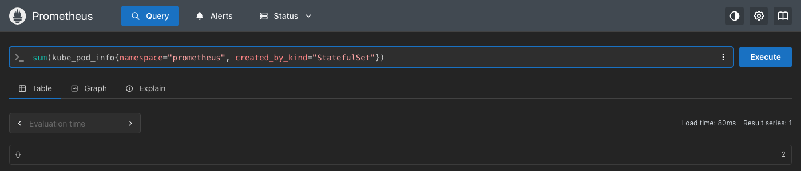

# Prometheus

Exercise 4.3 – DevOps with Kubernetes.

Prometheus runs on the GKE cluster, installed with the [kube-prometheus-stack](https://github.com/prometheus-community/helm-charts/tree/main/charts/kube-prometheus-stack) Helm chart into the `prometheus` namespace:

```bash
helm repo add prometheus-community https://prometheus-community.github.io/helm-charts
helm repo update
helm install kube-prometheus-stack prometheus-community/kube-prometheus-stack \
  --version 91.3.0 \
  --namespace prometheus --create-namespace \
  --set kubeControllerManager.enabled=false \
  --set kubeScheduler.enabled=false \
  --set kubeEtcd.enabled=false
```

GKE manages the control plane, so the controller manager, scheduler and etcd cannot be scraped; turning them off avoids targets that are always down.

## Accessing the GUI

The GUI is reached by port-forwarding through the Prometheus service:

```
$ kubectl -n prometheus get svc
NAME                                             TYPE        CLUSTER-IP       EXTERNAL-IP   PORT(S)                      AGE
alertmanager-operated                            ClusterIP   None             <none>        9093/TCP,9094/TCP,9094/UDP   81s
kube-prometheus-stack-alertmanager               ClusterIP   34.118.231.76    <none>        9093/TCP,8080/TCP            89s
kube-prometheus-stack-grafana                    ClusterIP   34.118.238.41    <none>        80/TCP                       89s
kube-prometheus-stack-kube-state-metrics         ClusterIP   34.118.239.209   <none>        8080/TCP                     89s
kube-prometheus-stack-operator                   ClusterIP   34.118.226.43    <none>        443/TCP                      89s
kube-prometheus-stack-prometheus                 ClusterIP   34.118.232.54    <none>        9090/TCP,8080/TCP            89s
kube-prometheus-stack-prometheus-node-exporter   ClusterIP   34.118.231.84    <none>        9100/TCP                     89s
prometheus-operated                              ClusterIP   None             <none>        9090/TCP                     80s

$ kubectl -n prometheus port-forward svc/kube-prometheus-stack-prometheus 9090:9090
Forwarding from 127.0.0.1:9090 -> 9090
Forwarding from [::1]:9090 -> 9090
Handling connection for 9090
```

Prometheus is then available at http://localhost:9090.

## Pods created by StatefulSets

`kube_pod_info` (from kube-state-metrics) has one series with the value 1 per pod, and its `created_by_kind` label names the kind of the pod's owner. Filtering by namespace and owner kind and summing the series gives the number of pods created by StatefulSets in the `prometheus` namespace:

```promql
sum(kube_pod_info{namespace="prometheus", created_by_kind="StatefulSet"})
```



The result is 2. The course example shows 3 for its setup, but this chart version creates two StatefulSets, one for Prometheus and one for Alertmanager:

```
$ kubectl -n prometheus get statefulsets
NAME                                              READY   AGE
alertmanager-kube-prometheus-stack-alertmanager   1/1     81s
prometheus-kube-prometheus-stack-prometheus       1/1     80s
```

Grafana, kube-state-metrics and the operator are Deployments, and node-exporter is a DaemonSet, so they are not counted.
