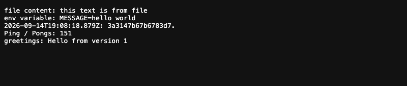
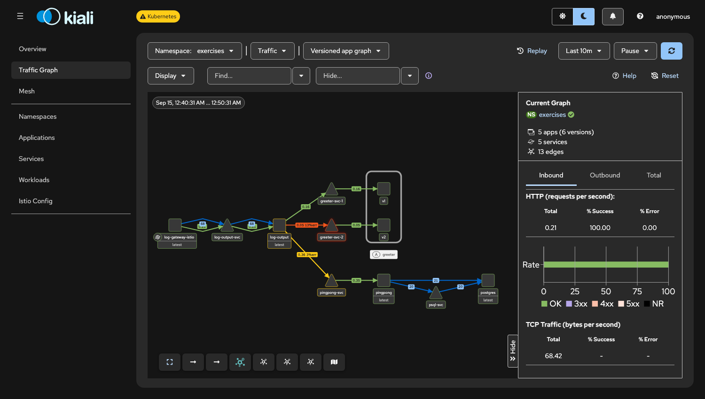

# Log output in the service mesh

Exercise 5.3 – DevOps with Kubernetes. Log output, Ping-pong and a new greeter service run in the Istio ambient mesh on the local k3d cluster (Istio setup: [Exercise 5.2](../istio/README.md)).

## Services

- **greeter** (`../greeter`, image `parthvasave/greeter:5.3`): answers `GET /` with `Hello from version <VERSION>`. The same image runs as two Deployments, `greeter-v1` (`VERSION=1`) and `greeter-v2` (`VERSION=2`), labelled `app: greeter` with `version: v1` / `v2`.
- **Log output** (`../log-output`, image `parthvasave/log-output:5.3`): when `GREETER_URL` is set (`http://greeter-svc/`), it fetches the greeting and adds a `greetings:` line to its output. Without the variable the line is left out, so the GitOps deployment on GKE (Exercise 4.7) is unchanged.
- **Ping-pong** (`parthvasave/ping-pong:5.3`, rebuilt for arm64) and **PostgreSQL** as before.



## Mesh and traffic split

`kustomization.yaml` deploys everything to the `exercises` namespace:

- `namespace.yaml` enrols all pods in the ambient mesh (`istio.io/dataplane-mode: ambient`) and sends their L7 traffic through the namespace's waypoint (`istio.io/use-waypoint: waypoint`, `waypoint.yaml`).
- `greeter.yaml` has three services: `greeter-svc`, which Log output calls and which selects both versions, and `greeter-svc-1` / `greeter-svc-2`, which select one version each. The HTTPRoute `greeter-split` has `greeter-svc` as its `parentRef`, so the waypoint sends 75% of the requests for `greeter-svc` to `greeter-svc-1` and 25% to `greeter-svc-2`.
- `gateway.yaml` is an Istio ingress Gateway with routes to Log output (`/`) and Ping-pong (`/pingpong`).

```bash
kubectl apply -f service-mesh/namespace.yaml
sops --decrypt ping-pong/manifests/secret.enc.yaml | kubectl apply -f -
kubectl apply -k service-mesh
kubectl -n exercises port-forward svc/log-gateway-istio 8080:80   # http://localhost:8080/
```

## Test

400 requests to Log output through the gateway:

```
$ for i in $(seq 1 400); do curl -s localhost:8080/ | grep -o "greetings: .*"; done | sort | uniq -c
 291 greetings: Hello from version 1
 109 greetings: Hello from version 2
```

That is 72.75% / 27.25%, close to the configured 75/25.

Kiali (versioned app graph of the `exercises` namespace) shows the same setup as the course example: the gateway calls Log output, which calls Ping-pong and `greeter-svc-1` (0.16 req/s, version v1) and `greeter-svc-2` (0.05 req/s, version v2), so about 76% of the greeter traffic goes to v1. The error rate on `greeter-svc-2` comes from `503` responses right after deployment, before the waypoint had received the route; later requests all succeeded.



The graph lists `greeter-svc` itself only as the route's parent, because the waypoint forwards its requests to `greeter-svc-1` and `greeter-svc-2`.
